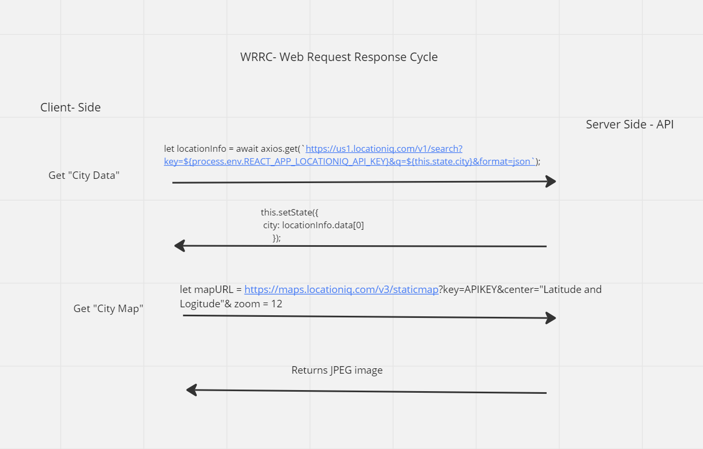

# City Explorer

**Author**: Harper Foley
**Version**: 2.0.0

## Overview

The purpose of this application is to allow the user to input a city and view it on a map. The application returns the formal name of the selected area, as well as the location's latitude and longitude and displays them on a newly rendered map. <br>

Additionally, the application will return a three day forecast for the selected city and a list of movies associated with the area.

## Getting Started

This application is fully functional once forked from the repo. The only changes that need to be made are the following:

1. Request a token for API access at [LocationIQ](https://locationiq.com/docs#search-forward-geocoding)
2. Once you have an API key, you will need to add a `.env` file on the same level as the `.gitignore` file
3. Copy the contents from `.env.sample` and paste into your newly created `.esv` file
4. Replace `<your-api-key-here>` with your actual API key
5. Run the following in the command line to install `npm` and launch your `localhost` to view the site

  ```js
  npm install
  npm run build
  npm start
  ```

## Architecture

This application uses JavaScript, React, Bootstrap, HTML5, and CSS3 languages.

## Change Log

* 11-14-2022 3:49pm PDT - Application now has ability to search for a location and render the area name, latitude, longitude, and a map with location icon.
* 11-16-2022 9:41pm PDT - Application deployed to Netlify and Render.
* 11-17-2022 8:38pm PDT - Adds WeatherDay and Movies components to handle rendering of individual instances of weather and movies.

## Credit and Collaborations

* Credit to Gordon Reilley and Tracy Oakley for the WRRC collaboration
  

## Time Estimates

### Feature 1: Locations

* **Name of feature:** [Locations](https://trello.com/c/NMSkUiMy/7-2-locations-as-a-user-of-city-explorer-i-want-to-enter-the-name-of-a-location-so-that-i-can-see-the-exact-latitude-and-longitude)
* **Estimate of time needed to complete:** 1 hour
* **Start time:** 11/14/2022 1:30pm PDT
* **Finish time:** 11/14/2022 2:30pm PDT
* **Actual time needed to complete:** 1:00

### Feature 2: Map

* **Name of feature:** [Map](https://trello.com/c/5ZucIQKb/8-3-map-as-a-user-i-want-to-see-a-map-of-the-city-so-that-i-can-see-the-layout-of-the-area-i-want-to-explore)
* **Estimate of time needed to complete:** 3 hours
* **Start time:** 11/14/2022 2:30pm PDT
* **Finish time:** 11/14/2022 6:00pm
* **Actual time needed to complete:** 3:30

### Feature 3: Error Handling

* **Name of feature:** [Error Handling](https://trello.com/c/XPZeO8jb/1-4-errors-as-a-user-i-want-clear-messages-if-something-goes-wrong-so-i-know-if-i-need-to-make-any-changes-or-try-again-in-a-diffe)
* **Estimate of time needed to complete:** 1 hours
* **Start time:** 11/14/2022 9:30pm PDT
* **Finish time:** 11/14/2022 9:56pm PDT
* **Actual time needed to complete:** :26

* **Name of feature:** [Live Weather](https://trello.com/c/66TupnMD/12-1-weather-live-as-a-user-of-city-explorer-i-want-to-see-weather-info-for-the-city-i-searched-so-that-i-know-how-to-pack-for-an-u)
* **Estimate of time needed to complete:** 2 hours
* **Start time:** 11-16-2022 1:30pm
* **Finish time:** 11-17-2022 2:00pm
* **Actual time needed to complete:** 8 hours

* **Name of feature:** [Top Movies](https://trello.com/c/9ATbIeI0/13-2-movies-as-a-user-of-city-explorer-i-want-to-see-info-about-movies-related-to-the-city-i-searched-so-that-i-can-learn-more-abou)
* **Estimate of time needed to complete:** 3 hours
* **Start time:** 11-16-2022 4:00pm PDT
* **Finish time:** 11-17-2022 2:30pm PDT
* **Actual time needed to complete:** 10 hours

* **Name of feature:** [Deployment of Live Server](https://trello.com/c/Z0kZDrZM/19-3-publish-deploy-your-server-as-a-user-i-want-to-access-the-city-explorer-application-on-the-web-so-that-anyone-can-explore-from)
* **Estimate of time needed to complete:** 1 hour
* **Start time:** 11-16-2022 5:00pm PDT
* **Finish time:** 11-17-2022 4:45pm PDT
* **Actual time needed to complete:** 6 hours

* **Name of feature:** [Caching](https://trello.com/c/aXIbMTEq/17-1-performance-as-a-user-i-want-the-application-to-work-with-recent-results-so-that-i-can-see-info-without-the-app-doing-unnecess)
* **Estimate of time needed to complete:** 1 hour
* **Start time:** 11-17-2022 2:00pm PDT
* **Finish time:** 11-17-2022 3:10pm PDT
* **Actual time needed to complete:** 1:10

<!-- Template
* **Name of feature:**
* **Estimate of time needed to complete:**
* **Start time:**
* **Finish time:**
* **Actual time needed to complete:** -->
